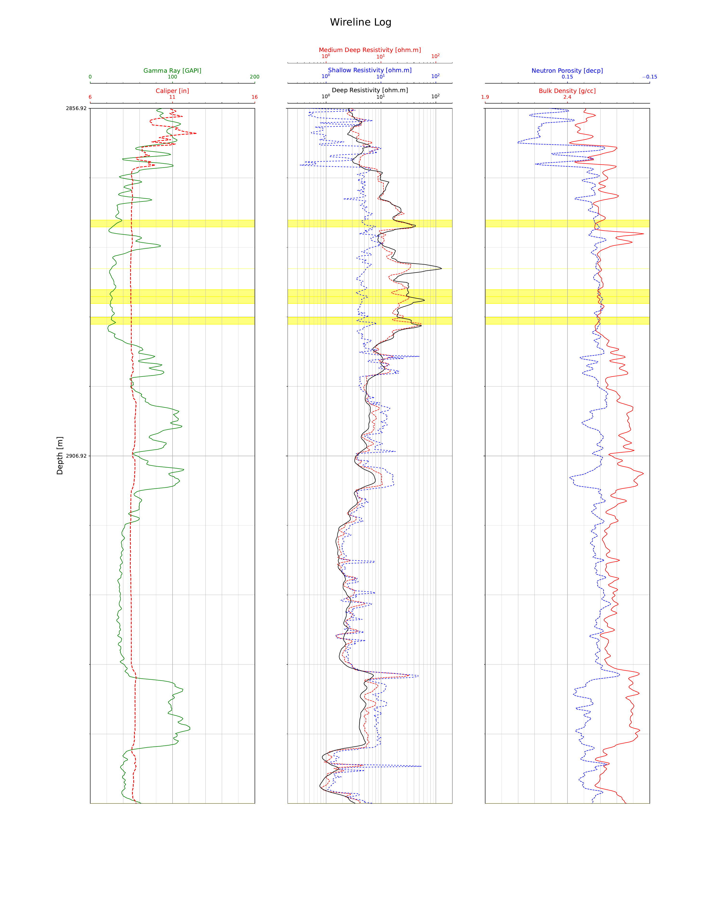

# Wireline Log Analysis

</img>

## Introduction

This repository contains a wireline log analysis project developed to analyze and interpret wireline logging data from oil wells. Wireline logging is a well logging technique used in the oil and gas industry to obtain detailed measurements of physical properties within a wellbore. This project aims to automate the analysis process and provide valuable insights into reservoir characterization.

## Dataset

The dataset is take from [Force 2020 Drive](https://drive.google.com/drive/folders/0B7brcf-eGK8CRUhfRW9rSG91bW8)

<table borders="0">
<tr><td>

| Column Name | Column Description                               |
|-------------|--------------------------------------------------|
| DEPTH_MD    | Measured Depth                                   |
| x loc       | X location of sample                             |
| y loc       | Y location of sample                             |
| z loc       | Z (TVDSS) Depth of sample                        |
| RDEP        | Deep Reading Resistivity measurement             |
| RSHA        | Shallow Reading Resistivity measurement          |
| RMED        | Medium Deep Reading Resistivity measurement      |
| RXO         | Flushed Zone Resistivity measurement             |
| RMIC        | Micro Resistivity measurement                    |
| SP          | Self Potential Log                               |
| DTS         | Shear wave sonic log (us/ft)                     |
| DTC         | Compressional waves sonic log (us(ft))           |
| NPHI        | Neutron Porosity log                             |
| PEF         | Photo Electric Factor log                        |
| GR          | Gamma Ray Log                                    |
| RHOB        | Bulk Density Log                                 |
| DRHO        | Density Correction log                           |
| CALI        | Caliper log                                      |
| BS          | Borehole Size                                    |
| DCAL        | Differential Caliper log                         |
| ROPA        | Average Rate of Penetration                      |
| SGR         | Spectra Gamma Ray log                            |
| MUDWEIGHT   | Weight of Drilling Mud                           |
| ROP         | Rate of Penetration                              |
| LITHOLOGY   | Interpreted Lithofacies                          |
| CONFIDENCE  | Qualitative measure of interpretation confidence |
| THOR        | Thorium Concentration                            |
| URAN        | Uranium Concentration                            |

</td><td>

| Label | Meaning         |
| ----- | --------------- |
| 30000 | Sandstone       |
| 65030 | Sandstone/Shale |
| 65000 | Shale           |
| 80000 | Marl            |
| 74000 | Dolomite        |
| 70000 | Limestone       |
| 70032 | Chalk           |
| 88000 | Halite          |
| 86000 | Anhydrite       |
| 99000 | Tuff            |
| 90000 | Coal            |
| 93000 | Basement        |
</td></tr> </table>

## Questions and Proposed work plan

1. What is the distribution of each sensor reading?
    a. Draw a histogram for each sensor reading

    **Purpose of the question**: understand the nature of the data

    </img>

2. How are the sensor readings correlated?
    a. Calculate the correlation
    b. Draw a Correlation heat map

    **Purpose of the question**: understand how redundant is the data

    </img>

3. How do well logs vary with depth?
    a. divide the well log data into different depth intervals
    b. calculate the mean and standard deviation of each depth interval
    c. plot the mean and standard deviation of each depth interval

    **Purpose of the question**: find out if the depth is affecting the other columns (is it a feature?)

    </img>

4. The means of gamma rays and neutron porosity are significantly different in shale and sandstone in the same well
    a. Use 2 sample t-test to test the significance of the hypothesis
    b. run the test on another dataset

    **Purpose of the question**: find out if neutron porosity and gamma rays are the main features of classifying the lithology as believed

5. Can we predict lithology accurately based on wireline well logs data?
    a. Train machine learning models using wireline well logs data
    B. Compare the accuracy of the models.

    **Purpose of the question**: classify the layers of lithology in the well to find the sandstone

6. Can we predict lithology without labeled data?
    a. Use clustering algorithms to identify clusters of similar lithology based on wireline well logs data.
    b. Compare the clusters to the labeled data to determine if the clusters correspond to different lithology.

    **Purpose of the question**: if the data labels are not accurate, can we have a better classification method

    </img>

7. What are the most important features or well-log measurements contributing to lithology prediction?
    a. Use feature selection algorithms to identify the most important features for lithology prediction.
    b. Compare the accuracy loss to the cost reduction

    **Purpose of the question**: can we reduce the readings acquired from the well to reduce the cost

    </img>

8. “Geologists say that geology is not random, however, petroleum engineers say that it is random based on their experience” Given several well logs for the same reservoir (spatial domain), can we infer that there is no relation between the well location and its quality?
    a. Select several wells in the same reservoir
    b. Calculate the mean and standard deviation of each well of the well lithology
    c. Compare the mean and standard deviation of each well (hypothesis testing using chi-square test)

    **Purpose of the question**: test the truth of the hypothesis

    </img>

9. Does the noise and anomalies in sensor readings provide any information?
    a. Find a model to detect anomalies in the data
    b. Analyze the anomalies to find any information

    **Purpose of the question**: find the specific characteristics of the oil spots

    </img>

10. Based on a prediction, what are the sweet spots of the existence of crude oil?
    a. Predict the lithology of the sensor readings
    b. pick the sandstone lithology with cross-over in the permeability and porosity graphs and high resistivity (higher than 10 ohm.m)
    b. visualize the sweet spots on a graph

    **Purpose of the question**: interpret the analysis results to the well log plot

    </img>

